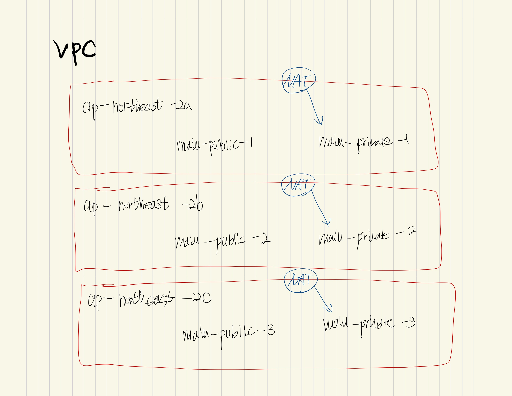

# Terraform practice

## Execute

```
    brew install hashicorp/tap/terraform
    brew update

    terraform --version
    terraform -help
```

## Command

```
    terraform init
    terraform apply
    terraform destroy
    terraform plan
    terraform plan -out out.terraform

    - SSH KEY : SSH KEY 만들기
    ssh-keygen -f name

    - AWS 자격증명 확인
    cat ~/.aws/credentials
```

## Basic-Terraform

- terraform-versioning (.tfstate)

## aws-ec2



## terraform-syntax

> Interpolation

```
    // Syntax
    var.name
    var.friends['leedonggyu']

    // Interpolate
    "${var.name}"
    "${lookup(var.friends, "leedonggyu")}"

```

> if/else

```
    "${var.name == "leedonggyu" ? true : false}"

    // Example

```

> Advanced Terraform Function

```
    // file
    "${file("leedonggyu.pub")}"

    // basename
    basename("/home/dk/file.txt")

    // coalesce
    host = coalesce(self.public_ip, self.private_ip)

    // element -> Return a index(seconds parameter)
    element(module.vpc.public_subents, count.index)

    // ...
```

> for, for-each

```
    [for s in ["a","b"]] : upper(s)]
```

## Terraform-folder-architecture

- Folder-Architecture

```
    - dev
        - dev.tf
        - prodivder.tf
        - vars.tf
        - versions.tf
    - prod
        - prod.tf
        - provider.tf
        - vars.tf
        - versions.tf
    - modules
        - instances
            - instance.tf
            - versions.tf
        - vpc
            - vpc.tf
            - instance.tf
```

## Refernece

- https://cloud-images.ubuntu.com/locator/ec2/
- https://developer.hashicorp.com/terraform/language/v1.1.x/configuration-0-11/interpolation
