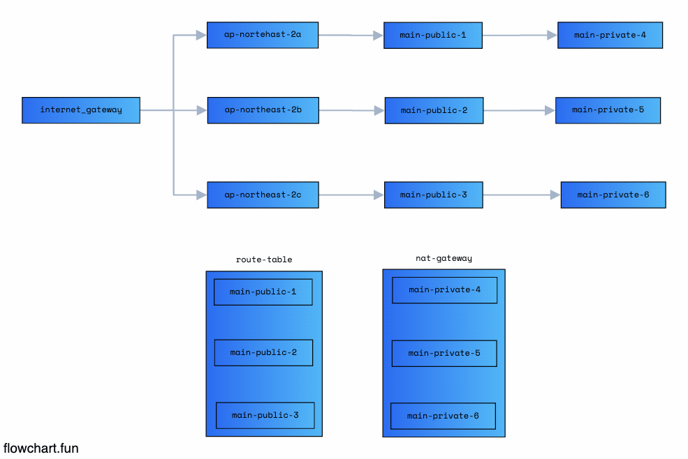

# Terraform

## tf-docker

- deploy docker use terraform

## tf-playground

- use variables use terraform console

```
    terraform console

    >> var.myVar
    >> var.myMap["name"]
    >> var.myList[0]
    >> slice(var.myList,0,1)
```

## tf-advance

- vars를 사용한 terraform 구조 정의 (Simple)

- provider

  - provider를 정의

- instance

  - 인스턴스를 정의

- vars.tf

  - \*.tfvars의 해당하는 변수네이밍

- terraform.tfvars

  - 변수의 값을 저장

  ```
    // terraform.tfvars
    AWS_ACCESS_KEY = ""
    AWS_SECRET_KEY = ""
    AWS_REGION = "ap-northeast-2"
  ```

## tf-vpc



- vpc.tf
  - Mapping Route Table == Public Subnet
- nat.tf
  - Mapping Route Table == Private Subnet

## tf-vpc-ec2

- VPC + EC2 use terraform
