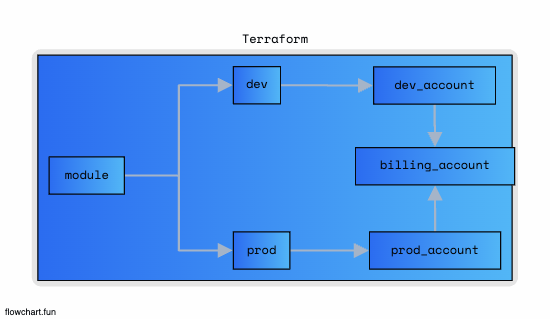

# Terraform

## tf-docker

- deploy docker use terraform

## tf-playground

- use variables use terraform console

```
    terraform console

    >> var.myVar
    >> var.myMap["name"]
    >> var.myList[0]
    >> slice(var.myList,0,1)
```

## tf-advance

- vars를 사용한 terraform 구조 정의 (Simple)

- provider

  - provider를 정의

- instance

  - 인스턴스를 정의

- vars.tf

  - \*.tfvars의 해당하는 변수네이밍

- terraform.tfvars

  - 변수의 값을 저장

  ```
    // 1. terraform.tfvars
    AWS_ACCESS_KEY = ""
    AWS_SECRET_KEY = ""
    AWS_REGION = "ap-northeast-2"

    // 2. DEV OR PROD 설정
    terraform apply -var ENV=dev

    // 3. Stored Function
    basename("/home/leedonggyu/file.txt") >> file.txt 경로의 마지막 요소의 파일이름 반환
    coalesce("","","hello) >> hello 값이 있는것만 반환
    element(module.vpc.public_subnets, count.index) >> module.vpc.public_subnest[count.index]
    ... more homepage
  ```

## tf-vpc


- vpc.tf
  - Mapping Route Table == Public Subnet
- nat.tf
  - Mapping Route Table == Private Subnet

## tf-vpc-ec2

- VPC
  - vpc.tf
  - nat.tf
- EBS
  - instance.tf
- EIP
  - instance.tf
- RDS
  - rds.tf

## tf-iam

- set iam use terraform

## tf-elasticBeanstalk

- setting ealsticBeanstalk use terraform

## tf-architecture

- best practice terraform folder architecture



```
  modules
    instance (module로 관리)
    vpc (module로 관리)
  dev
  prod

  ~/dev terraform init
  ~/prod terraform init
```
